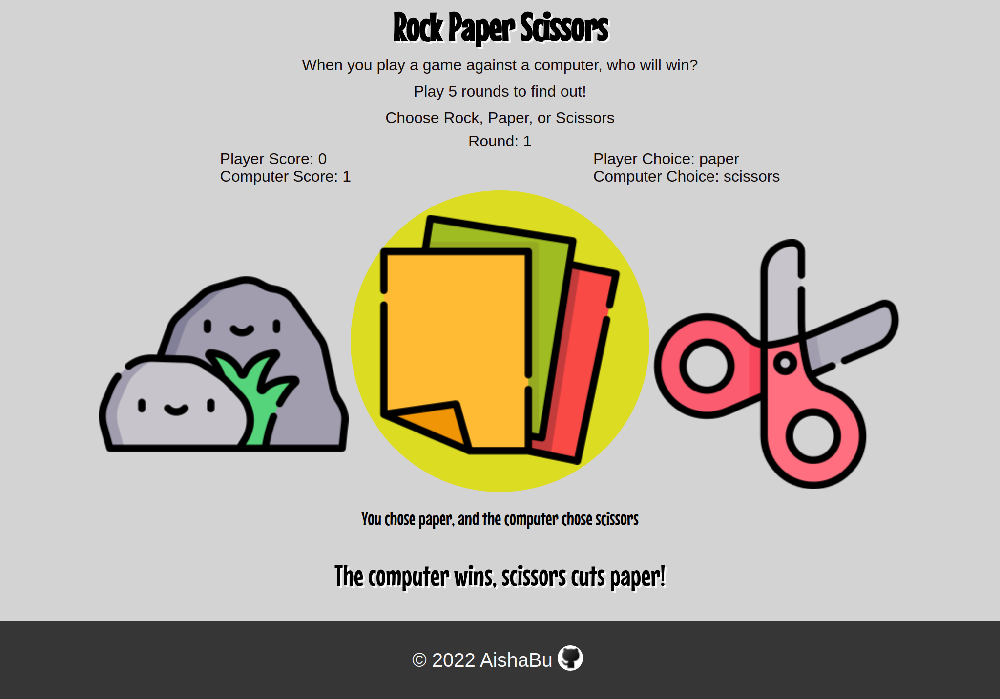
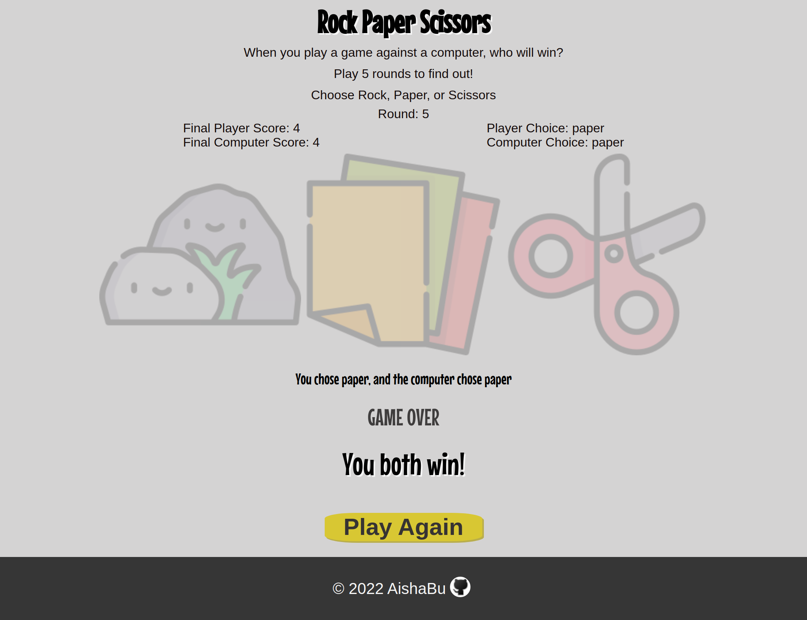
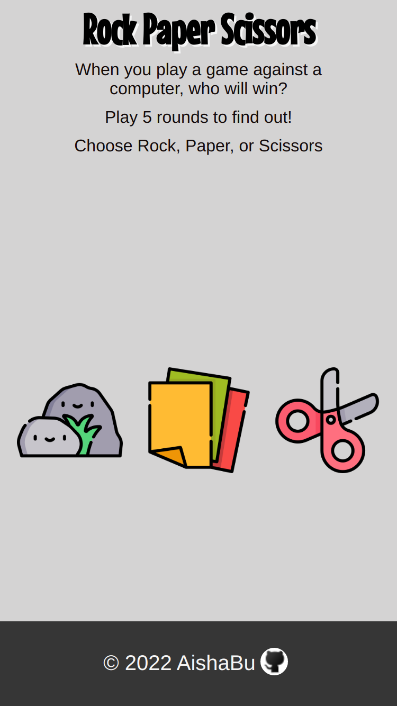
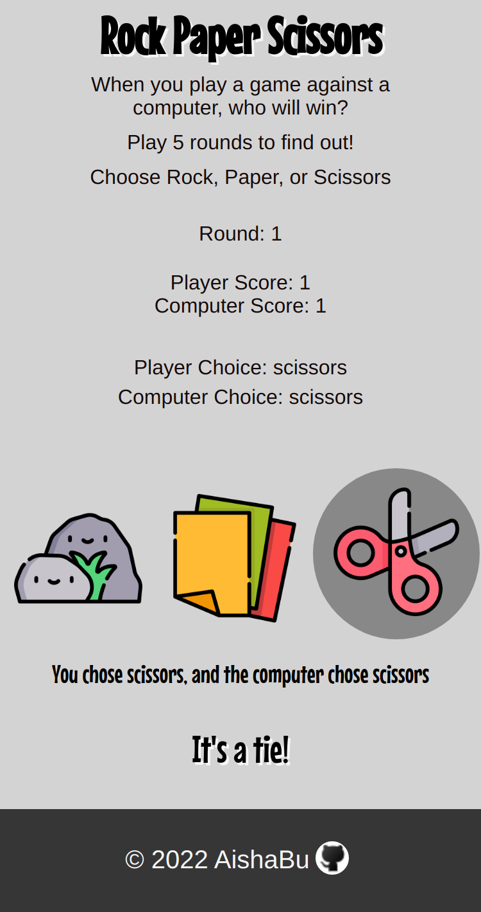
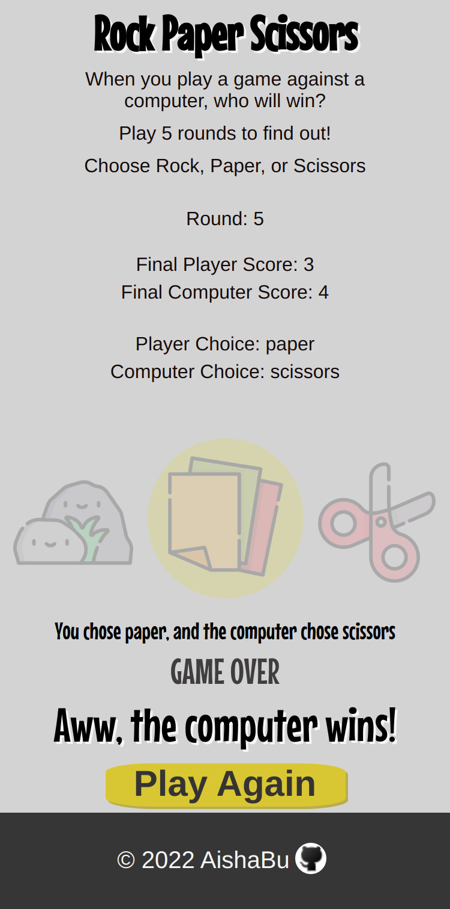

# Rock, Paper, Scissors Game

<table>
    <tr>
    <td></td>
    </tr>
</table>

### Description
This rock, paper, scissors game was made for the Rock, Paper, Scissors assignment in the Odin Project. The assignment deliverables where to make a rock paper scissors game using HTML, CSS, and JavaScript. While creating this game, I practiced DOM manipulation using JavaScript, and got a better understanding of scope and the use of functions and the return keyword in JavaScript. 

#### Desktop Devices
<table>
    <tr>
    <td></td>
     <td></td>
     </tr>
</table>

#### Mobile Devices
<table>
    <tr>
    <td></td>
     <td></td>
      <td></td>
     </tr>
</table>

### Live Site
[Rock, Paper, Scissors Game](https://aishabu.github.io/rock-paper-scissors/)

### Built With 
HTML  
CSS 
JavaScript 

### Sources
#### Rock, Paper, Scissors Icons 
<a href="https://www.flaticon.com/free-icons/rock" title="rock icons">Rock icons created by Freepik - Flaticon</a> 
<a href="https://www.flaticon.com/free-icons/paper" title="paper icons">Paper icons created by Freepik - Flaticon</a> 
<a href="https://www.flaticon.com/free-icons/scissors" title="scissors icons">Scissors icons created by Freepik - Flaticon</a>

#### Odin Project
[Odin Recipes Homepage](https://www.theodinproject.com/)
